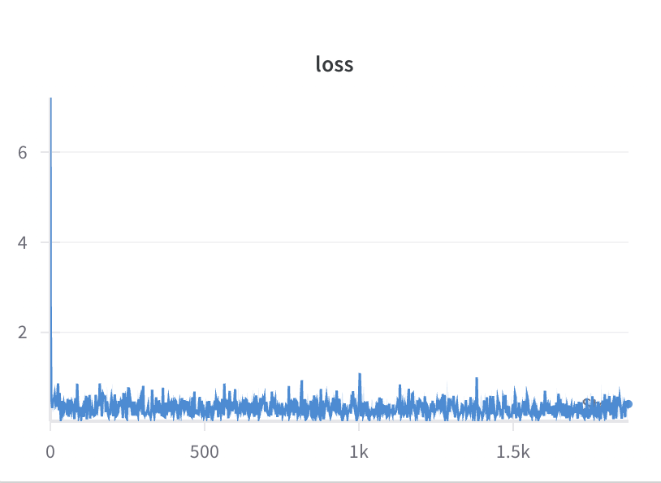

# QLoRA Financial Fine-Tuning with Qwen2.5-7B


This project provides a complete, reproducible template for fine-tuning large language models using [QLoRA](https://arxiv.org/abs/2305.14314) with Hugging Face's `accelerate` framework.  
It is intended as a learning resource and starting point for developers looking to:

- Fine-tune models on custom instruction datasets
- Use low-rank adaptation (LoRA) with 4-bit quantization (NF4)
- Perform multi-GPU training with `accelerate`
- Deploy the result in an interactive Gradio chatbot

---

### Pretrained Model Released on Hugging Face

The fine-tuned QLoRA model has been fully released on Hugging Face:

**Model repo:**  
[https://huggingface.co/lucus112/QLoRA_qwen2.5-7b-finance](https://huggingface.co/lucus112/QLoRA_qwen2.5-7b-finance)

You can download it using our `download.sh` script or load it directly with `transformers`.

## Project Highlights

- Based on Qwen2.5-7B-Instruct, a strong multilingual instruction model
- Finetuned on real-world financial tasks using instruction-style datasets (100k+ samples)
- Uses QLoRA (4-bit NF4 quantization + LoRA) to reduce memory usage while maintaining quality
- Supports multi-GPU training using `accelerate`
- Provides both training and inference pipeline
- Includes download script, gradio demo, and data preprocessing

```
qwen-qlora-project/
├── train.py                        # Training script using QLoRA
├── gradio_demo.py                  # Streamed chat demo with Gradio
├── download.sh                     # Downloads the trained model to correct folder
├── QLoRA_qwen2.5-7b-finance/       # Full merged model (for inference)
├── Qwen2.5-7B-Instruct/            # Base model for training (must be manually downloaded)
├── adapter&tokenizer_qwen2.5-7b/   # LoRA adapter & tokenizer only (optional, non-merged)
│   ├── adapter_model.bin
│   └── tokenizer_config.json
├── data/                           # Training data and sample
│   └── 30k_qllora_format.jsonl    # Small sample kept for demo
├── .gitignore
└── README.md
```

---

## Training vs Inference Models

This repo distinguishes two different model folders:

1. `Qwen2.5-7B-Instruct/`  
   This is the **base model** required for training. You must download this into the project directory if you want to reproduce or continue training.

2. `QLoRA_qwen2.5-7b-finance/`  
   This is the **fine-tuned model**, automatically downloaded via `download.sh`, and used directly for demo or evaluation.

---

## How to Download Fine-tuned Model for Inference

To download the trained model (used for running Gradio or evaluation), run:

```bash
bash download.sh
```

This will automatically download the model files from Hugging Face:
- Model repo: lucus112/QLoRA_qwen2.5-7b-finance
- Target folder: ./QLoRA_qwen2.5-7b-finance

Once downloaded, you can:
- Load the model using AutoModelForCausalLM.from_pretrained() in your own inference/evaluation script
- Run the Gradio chatbot for interactive financial Q&A (see deploy/demo.py)

You can then load it in Python as:

## How to Prepare for Training

To run training, you must first download the original base model into the project directory(./Qwen2.5-7B-Instruct):

```bash
git lfs install
git clone https://huggingface.co/Qwen/Qwen2.5-7B-Instruct Qwen2.5-7B-Instruct
```

Important:
- The folder must be named exactly Qwen2.5-7B-Instruct
- It must be placed at the root of the project directory
- If you rename or move it, training scripts will fail to locate the base model

Once downloaded, your project structure should look like:

```
qwen-qlora-project/
├── Qwen2.5-7B-Instruct/
│   ├── config.json
│   ├── model-00001-of-00002.safetensors
│   └── ...
```

Experimental Setup
- Base model: Qwen2.5-7B-Instruct
- Training method: QLoRA (4-bit NF4 quantization + LoRA)
- LoRA target modules:
  - Attention: q_proj, k_proj, v_proj, o_proj
  - MLP: gate_proj, up_proj, down_proj
- LoRA config:
  - r=64, alpha=32, dropout=0.05
- Training dataset: 100k instruction samples (JSONL format)
- Average token length: ~395 tokens per sample
- Batch size: 5, with gradient_accumulation_steps=4
- Training framework: Hugging Face transformers, peft, accelerate
- Tracking: Integrated with Weights & Biases (wandb)

Model Chat Demo

You can launch a local Gradio chat interface for testing:

```bash
python gradio_demo.py
```

## Training Metrics

The following curves were recorded during training using wandb:




These plots demonstrate stable convergence, a smooth cosine learning rate schedule, and overall training health.
